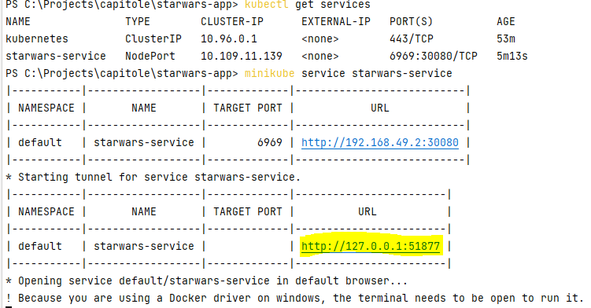
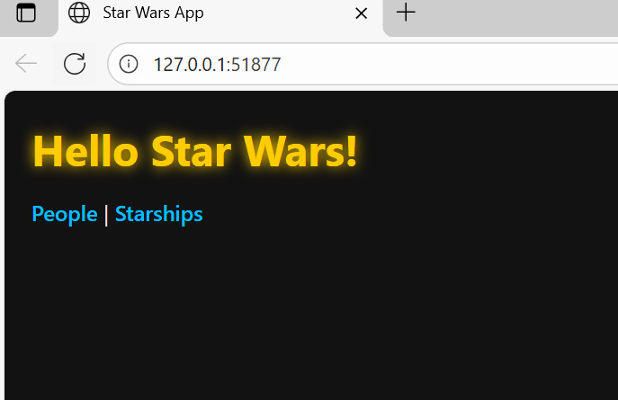
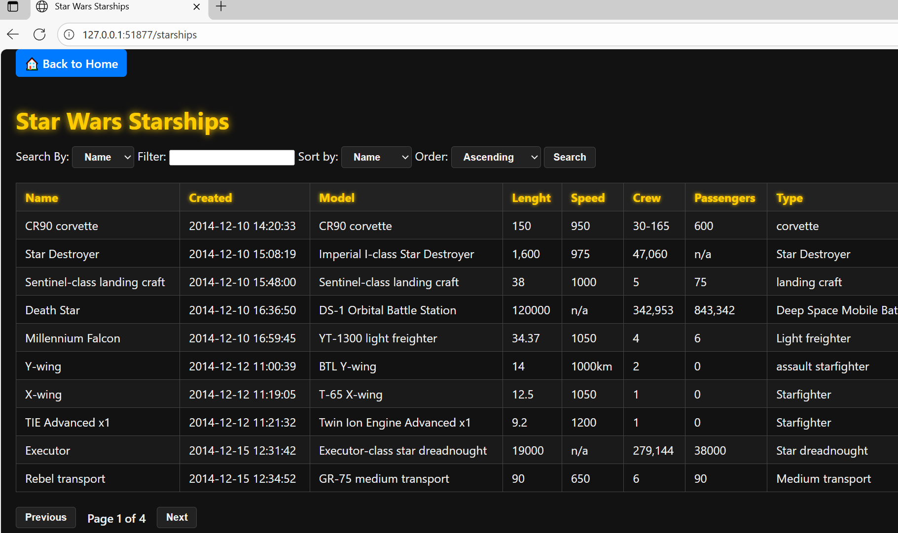

# Star Wars Viewer

A simple Spring Boot project to display data from the [Star Wars API (SWAPI)](https://swapi.py4e.com/).  
Currently, it shows **People** and **Starships** in a basic web interface.

## Tech Stack
- Java 17+
- Spring Boot
- Gradle
- Thymeleaf
- Docker & Docker Compose

## Implementation Details
The application demonstrates two different approaches for fetching and displaying data:

- **People Page**  
  Uses a simple pagination approach, fetching data **page by page** directly from SWAPI.  
  Sorting is applied only to the currently displayed page,by clicking on column headers like **Name** or **Created**.  
  Search or filtering is not implemented on the People page.

- **Starships Page**  
  Implements a more advanced logic:
    - When the user first loads the page or performs a search/filter, **all starships are fetched** from SWAPI and stored in an **in-memory cache**.
    - The user can perform global sorting on the entire dataset by fields like Name or Created. 
    - Additionally, the user can filter (search) starships by Name or Model via a search box and a dropdown selector. This filtering is applied globally to the cached data. 
    - Pagination is done on the filtered and sorted cached list, avoiding repeated calls to SWAPI.

## Getting Started

### Run the project
```bash
./gradlew bootRun
```
The app will be available at http://localhost:8080.

### Run with Docker

Build and start the container:

```bash
docker-compose up --build
```
The app will be available on port 6969 (http://localhost:6969) , as configured in docker-compose.yml

### Run with Kubernetes
You can also deploy the application on a local Kubernetes cluster using Minikube.
Two resource files are included:
- ```deployment.yml``` (deploys 3 replicas of the app)
- ```service.yml``` (exposes the app on a NodePort)
To run it on Minikube, follow these steps:
```bash
# Build the Docker image inside Minikube
minikube image build -t starwars-app:latest .

# Deploy the application
kubectl apply -f deployment.yml
kubectl apply -f service.yml

# Check pods and services status
kubectl get pods
kubectl get services

# Minibuke opens startwar-service in default browser
minikube service starwars-service

 ```
  

  

  